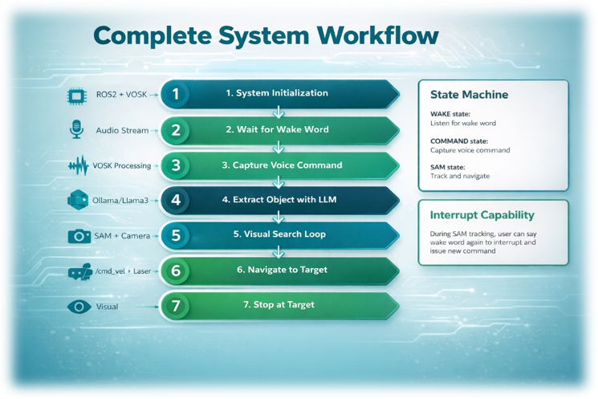
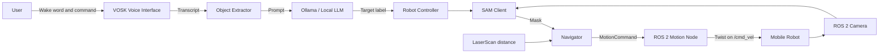
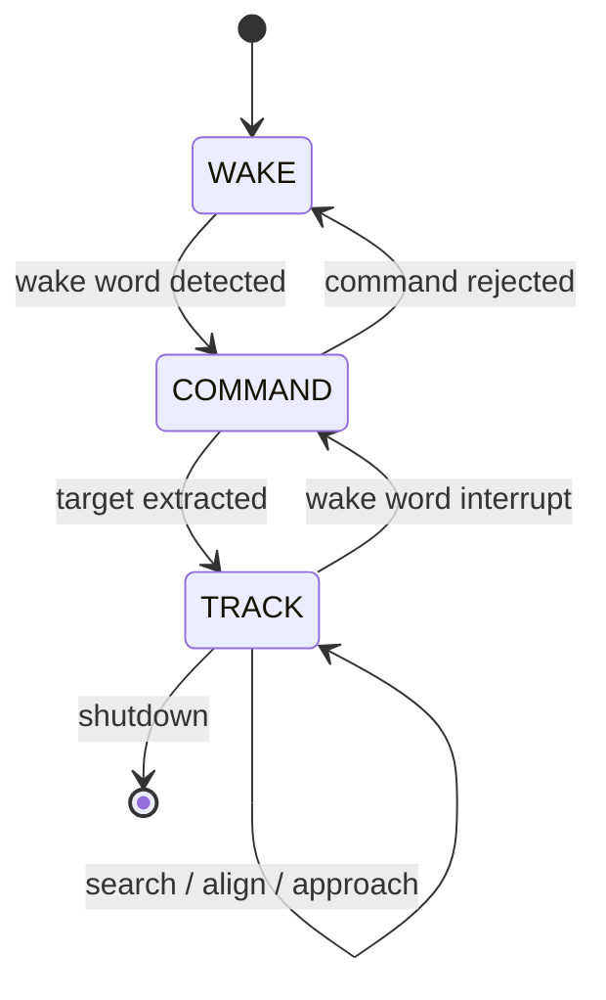

# AI-Powered Autonomous Robot Navigation

[](https://www.python.org/)
[](https://docs.ros.org/en/humble/)
[](#testing)
[](LICENSE)
[](#project-status)

A modular voice-controlled robotics system that converts a spoken command into autonomous visual navigation. The robot recognizes a wake word, extracts the requested object with a locally hosted LLM, segments the target using a SAM-based service, and approaches it through reactive ROS 2 control.

> Example interaction: say **“Hi Robot”**, then **“Go to the red ball.”** The robot searches for the target, aligns with it, approaches it, and stops once the configured proximity criteria are met.

<p align="center">
  
</p>

## Demo

The repository is prepared for a short portfolio GIF and a full demonstration video. Add the final files using the naming and recording guide in [`media/README.md`](media/README.md).

<!-- Enable after adding the real demo file.
<p align="center">
  
</p>
-->

## Highlights

- Offline wake-word and speech recognition with VOSK
- Natural-language target extraction through Ollama and a local LLM
- Text-guided object segmentation through a remote SAM-compatible service
- ROS 2 camera, LaserScan, and `/cmd_vel` integration
- Deterministic search controller for temporarily invisible targets
- Proportional visual alignment and controlled forward approach
- Visual and LaserScan-based stop conditions
- Wake-word interruption while the robot is tracking
- Live OpenCV visualization with mask, centroid, direction, and behavior status
- Modular architecture with isolated voice, LLM, vision, ROS, navigation, UI, and orchestration layers
- Unit tests for the pure navigation logic

## End-to-end pipeline



The complete component design and runtime sequence are documented in [`docs/architecture.md`](docs/architecture.md).

## Runtime behavior

The application uses three top-level states:



Inside `TRACK`, the `Navigator` chooses one of two deterministic behaviors:

1. **Search:** alternate between a timed rotation and a short forward movement while the target is not recently visible.
2. **Track:** align with the target centroid, approach only when sufficiently centered, slow down near the target, and stop when a configured threshold is reached.

## Architecture

The refactored implementation separates hardware and service integration from pure decision logic:

```text
RobotController
├── VoiceListener
├── ObjectExtractor
├── SamClient
├── RobotCamera
├── RobotMotion
├── Navigator
│   ├── SearchController
│   └── TrackingController
└── Visualizer
```

`RobotController` owns the lifecycle and state transitions. `Navigator` returns a framework-independent `MotionCommand`; only `RobotMotion` publishes ROS 2 velocity messages. This separation keeps the navigation decisions testable without a robot or ROS runtime.

## Repository structure

```text
.
├── .github/
│   ├── ISSUE_TEMPLATE/
│   └── pull_request_template.md
├── docs/
│   ├── architecture.md
│   ├── code-overview.md
│   ├── setup.md
│   ├── troubleshooting.md
│   └── images/
│       └── system-workflow.png
├── media/
│   ├── README.md
│   └── screenshots/
├── src/
│   ├── main.py
│   ├── config.py
│   ├── state.py
│   ├── controllers/
│   │   └── robot_controller.py
│   ├── llm/
│   │   └── object_extractor.py
│   ├── navigation/
│   │   ├── models.py
│   │   ├── navigator.py
│   │   ├── search_controller.py
│   │   └── tracking_controller.py
│   ├── ros_nodes/
│   │   ├── camera_node.py
│   │   └── motion_node.py
│   ├── ui/
│   │   └── visualizer.py
│   ├── vision/
│   │   ├── mask_utils.py
│   │   └── sam_client.py
│   └── voice/
│       └── listener.py
├── tests/
│   └── test_navigation.py
├── CHANGELOG.md
├── CONTRIBUTING.md
├── LICENSE
├── SECURITY.md
├── requirements.txt
└── requirements-dev.txt
```

## Technology stack

| Area | Technology |
|---|---|
| Language | Python 3.10+ |
| Robotics middleware | ROS 2 Humble |
| Speech recognition | VOSK |
| Language model serving | Ollama |
| Computer vision | SAM-compatible service, OpenCV, NumPy |
| Robot I/O | ROS 2 Image, LaserScan, and Twist messages |
| Remote infrastructure | GPU services exposed through SSH tunnels |
| User feedback | Terminal logging and OpenCV live view |
| Testing | pytest |

## Requirements

### Runtime software

- Ubuntu environment compatible with ROS 2 Humble
- Python 3.10 or newer
- ROS 2 Humble and the robot workspace
- VOSK English speech model
- Reachable Ollama endpoint with the configured model
- Reachable SAM-compatible segmentation endpoint
- Graphical desktop access for the OpenCV window

### Hardware

- ROS 2-compatible mobile robot
- RGB camera publishing a ROS image topic
- Microphone
- Laser scanner for front-distance input
- GPU-backed SAM service in the original deployment

## Installation

```bash
git clone https://github.com/ICHBINMINIDA/AI-Powered-Autonomous-Robot-Navigation.git
cd AI-Powered-Autonomous-Robot-Navigation

python3 -m venv .venv
source .venv/bin/activate
pip install -r requirements.txt

source /opt/ros/humble/setup.bash
# source ~/your_ros2_workspace/install/setup.bash
```

Adapt the values in [`src/config.py`](src/config.py), especially:

- VOSK model path
- Ollama URL and model
- SAM service URL
- image, LaserScan, and `/cmd_vel` topics
- search, alignment, speed, and stop thresholds

The full environment and SSH-tunnel procedure is available in [`docs/setup.md`](docs/setup.md).

## Running

From the repository root:

```bash
python3 src/main.py
```

Expected interaction:

```text
Robot ready | say: hi robot
Wake word detected
Speak command
Command: go to the red ball
Object: red ball
```

Press `ESC` in the OpenCV window or `Ctrl+C` in the terminal to stop safely.

## Configuration

All runtime constants are grouped in the immutable `Settings` dataclass in [`src/config.py`](src/config.py). The most influential parameters are:

| Parameter | Purpose |
|---|---|
| `sam_interval_seconds` | Minimum delay between segmentation requests |
| `search_turn_speed` | Angular velocity during visual search |
| `search_turn_time` | Duration of each search rotation phase |
| `search_forward_speed` | Forward velocity between rotations |
| `angular_gain` | Proportional visual steering gain |
| `center_go_threshold` | Maximum horizontal error that still allows forward motion |
| `target_stop_distance` | LaserScan-based target stop threshold |
| `stop_area_ratio` | Mask-area stop threshold |
| `stop_bbox_height_ratio` | Bounding-box-height stop threshold |

## Testing

The pure navigation controllers can be tested without ROS 2, a camera, or AI services:

```bash
pip install -r requirements-dev.txt
pytest -q
```

Current test coverage verifies core search and tracking behavior, including phase transitions and stop decisions. Hardware integration must still be validated in the target ROS 2 environment.

## Design choices

- **Local AI services:** speech recognition and language processing can run without sending commands to a public cloud API.
- **Deterministic motion control:** the LLM extracts the target object, but it does not directly generate wheel commands.
- **Reactive navigation:** the system uses current visual and distance feedback rather than SLAM or global planning.
- **Testable decision layer:** navigation controllers operate on dataclasses and return `MotionCommand` objects without depending on ROS.
- **Explicit limitations:** the documentation avoids claiming obstacle avoidance, SLAM, or global path planning.

## Current limitations

- No SLAM or global map
- No global path planner
- No complete obstacle-avoidance planner
- The first valid SAM mask is selected
- No dedicated multi-frame object tracker
- Runtime configuration is currently stored in Python
- The full stack was validated in a specific university robot and GPU environment
- Automated tests cover pure navigation logic, not hardware or remote service integration

## Project status

**Working prototype in the original university environment.**

Completed:

- end-to-end voice-to-object-to-navigation pipeline;
- modular codebase after the Sprint 1 and Sprint 2 refactoring;
- dedicated search, tracking, orchestration, UI, ROS, vision, voice, and LLM modules;
- unit tests for deterministic navigation behavior;
- architecture, setup, troubleshooting, and code documentation;
- repository templates and portfolio media structure.

Remaining before the public portfolio release:

- add the real demo GIF and video link;
- add selected screenshots from the live robot run;
- validate the refactored build again on the physical robot;
- optionally move runtime settings to YAML or environment variables.

## Documentation

- [Architecture](docs/architecture.md)
- [Code overview](docs/code-overview.md)
- [Setup guide](docs/setup.md)
- [Troubleshooting](docs/troubleshooting.md)
- [Demo and screenshot guide](media/README.md)
- [Contributing](CONTRIBUTING.md)
- [Changelog](CHANGELOG.md)

## Author

**Hamza El Madani**

- GitHub: [ICHBINMINIDA](https://github.com/ICHBINMINIDA)
- LinkedIn: [hamza-el-madani-263a09385](https://www.linkedin.com/in/hamza-el-madani-263a09385/)

## License

This project is released under the [MIT License](LICENSE).
