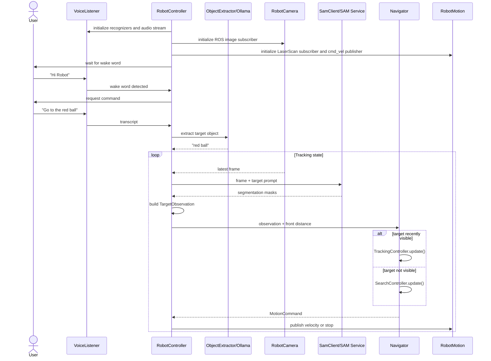
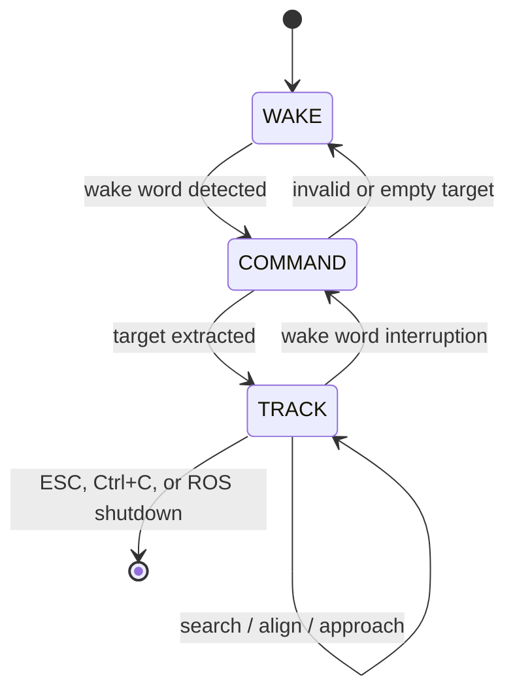
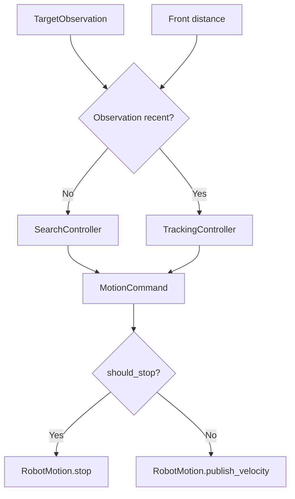

# System Architecture

## 1. Overview

The application integrates speech recognition, local language-model inference, text-guided object segmentation, and ROS 2 robot control. It is intentionally reactive: the robot does not create a global map and does not run a global planner. Motion decisions are based on recent image segmentation results and the current front LaserScan distance.

The refactoring separates integration concerns from decision logic. ROS nodes and external service clients handle I/O, while the navigation package contains deterministic, testable behavior.

## 2. Component architecture

```mermaid
flowchart TB
    subgraph Interaction[User interaction]
        MIC[Microphone]
        VIEW[OpenCV live view]
    end

    subgraph VoiceLayer[Voice layer]
        VL[VoiceListener]
        VOSK[VOSK recognizers]
    end

    subgraph LanguageLayer[Language layer]
        OE[ObjectExtractor]
        OL[Ollama local LLM]
    end

    subgraph Orchestration[Application layer]
        RC[RobotController]
        ST[RobotState]
    end

    subgraph VisionLayer[Vision layer]
        CAM[RobotCamera]
        SAM[SamClient]
        GPU[SAM GPU service]
        MASK[Mask utilities]
    end

    subgraph NavigationLayer[Navigation layer]
        NAV[Navigator]
        SEARCH[SearchController]
        TRACK[TrackingController]
        MODEL[TargetObservation / MotionCommand]
    end

    subgraph RobotLayer[ROS 2 layer]
        MOTION[RobotMotion]
        SCAN[LaserScan]
        CMD[/cmd_vel]
        BASE[Mobile robot]
    end

    MIC --> VL --> VOSK
    VL --> RC
    RC --> OE --> OL --> OE --> RC
    CAM --> RC
    RC --> SAM --> GPU --> SAM
    SAM --> MASK --> RC
    SCAN --> MOTION --> RC
    RC --> NAV
    NAV --> SEARCH
    NAV --> TRACK
    SEARCH --> MODEL
    TRACK --> MODEL
    MODEL --> RC --> MOTION --> CMD --> BASE
    RC --> VIEW
    BASE --> CAM
    RC --> ST
```

## 3. Layer responsibilities

| Layer | Main modules | Responsibility |
|---|---|---|
| Entry point | `src/main.py` | Configure logging, create the controller, run, and shut down safely |
| Orchestration | `controllers/robot_controller.py` | Own lifecycle, state transitions, service calls, observations, and motion execution |
| Voice | `voice/listener.py` | Capture microphone input and operate wake-word and command recognizers |
| Language | `llm/object_extractor.py` | Convert a free-form command into a concise target label |
| Vision | `vision/sam_client.py`, `vision/mask_utils.py` | Request segmentation and derive centroid, bounding box, and area |
| Navigation | `navigation/*` | Choose search or tracking and produce framework-independent motion commands |
| ROS 2 | `ros_nodes/*` | Receive camera/LaserScan data and publish velocity commands |
| UI | `ui/visualizer.py` | Draw detection and behavior information and manage the OpenCV window |
| Configuration | `config.py` | Store immutable service, topic, timing, speed, and threshold settings |

## 4. Runtime sequence



## 5. State machine



### WAKE

The system waits for the configured wake phrase. No navigation command is active.

### COMMAND

The following speech segment is transcribed and passed to the object extractor. A valid concise object label transitions the controller into tracking.

### TRACK

The controller periodically calls the SAM service, updates the latest `TargetObservation`, asks the `Navigator` for a `MotionCommand`, and publishes that command through `RobotMotion`.

A newly detected wake word interrupts tracking, stops the robot, resets the speech recognizers, and returns to `COMMAND`.

## 6. Navigation decision architecture



### SearchController

The search behavior alternates between two timed phases:

- `TURN`: rotate in place using `search_turn_speed`;
- `FORWARD`: move briefly using `search_forward_speed` when the front distance is safe.

It does not own ROS publishers and can therefore be unit tested with simulated times and distances.

### TrackingController

The tracking controller:

1. checks the LaserScan and visual stop conditions;
2. computes proportional angular correction from the horizontal target error;
3. allows forward motion only when the target is sufficiently centered;
4. reduces speed as the target becomes visually larger;
5. returns a `MotionCommand` rather than publishing directly.

### Navigator

`Navigator` selects the search or tracking controller based on whether the latest observation is still recent. A successful detection resets the search phase.

## 7. Data models

### TargetObservation

Represents the latest processed target detection. It contains:

- detection timestamp;
- mask and centroid;
- normalized horizontal error;
- mask-area ratio;
- bounding-box-height ratio;
- qualitative direction label.

### MotionCommand

Represents the desired robot action independently of ROS:

- linear velocity;
- angular velocity;
- stop flag;
- human-readable status.

This model boundary is the key reason the navigation logic is testable without hardware.

## 8. External service deployment

In the original setup, Ollama and SAM ran on a university GPU server. The robot-side process reached them through local SSH tunnels:

```text
Robot application
    ├── localhost:18080 -> remote Ollama endpoint
    └── localhost:15000 -> remote SAM endpoint
```

Exact commands depend on the server host, user account, and remote ports. Examples are provided in [`setup.md`](setup.md).

## 9. Safety and scope

The application includes conservative stopping support, but it is not a certified safety system. LaserScan input is used as a front-distance condition; it is not a complete obstacle-avoidance planner.

The project deliberately does not claim:

- SLAM;
- global mapping;
- global path planning;
- complete dynamic obstacle avoidance;
- autonomous navigation in arbitrary uncontrolled environments.

## 10. Extension points

The architecture can be extended without placing new logic in `main.py`:

- replace SAM through the `SamClient` boundary;
- replace the LLM through `ObjectExtractor`;
- add YAML or environment-based configuration;
- add a dedicated temporal tracker after `TargetObservation` creation;
- add a planner behind `Navigator` while preserving `MotionCommand`;
- add integration tests with mocked ROS messages and HTTP endpoints.
